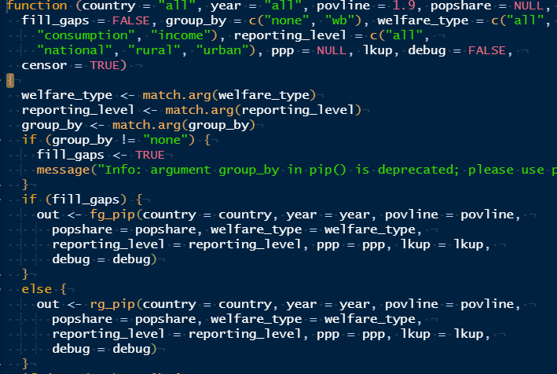

<!-- README.md is generated from README.Rmd. Please edit that file -->

# pip-fake-data

The goal of pip-fake-data is to enable end-users to more easily explore
the computations that generates the poverty and inequality statistics
published on [PIP](https://pip.worldbank.org/home)

Since most data used in PIP are confidential microdata, this fake
dataset has been created to match the exact format expected by the
[pipapi](https://github.com/PIP-Technical-Team/pipapi) package.

# Getting started

1.  Download the `pip-fake-data` repo on your machine
2.  Open the `pip-fake-data` Rstudio project. This is will ensure your
    the `pip-fake-data` folder is your working directory, which is a
    requisite for the code below to work correctly.
3.  Make sure the `pipapi` package is installed on your machine.  
    **Temporary** Please install the development branch of `pipapi`
    using the following command:
    `remotes::install_github('PIP-Technical-Team/pipapi@dev')`

``` r
library(pipapi)
#> Info: Disk based caching is enabled.
lkups <- create_versioned_lkups(data_dir = ".")
lkups$versions
#> [1] "20211212_2011_01_01_PROD" "20200101_2011_01_01_PROD"
lkup <- lkups$versions_paths$`20211212_2011_01_01_PROD`
```

## Run main `pip` function

``` r
out <- pip(country = "all", year = "all", povline = 1.9, lkup = lkup)
str(out)
#> Classes 'data.table' and 'data.frame':   22 obs. of  40 variables:
#>  $ region_name         : chr  "East Asia and Pacific" "East Asia and Pacific" "East Asia and Pacific" "East Asia and Pacific" ...
#>  $ region_code         : chr  "EAP" "EAP" "EAP" "EAP" ...
#>  $ country_name        : chr  "China" "China" "China" "China" ...
#>  $ country_code        : chr  "CHN" "CHN" "CHN" "CHN" ...
#>  $ reporting_year      : num  1981 1981 1990 1990 2002 ...
#>  $ reporting_level     : chr  "rural" "urban" "rural" "urban" ...
#>  $ survey_acronym      : chr  "CRHS-CUHS" "CRHS-CUHS" "CRHS-CUHS" "CRHS-CUHS" ...
#>  $ survey_coverage     : chr  "national" "national" "national" "national" ...
#>  $ survey_year         : num  1981 1981 1990 1990 2002 ...
#>  $ welfare_type        : chr  "income" "income" "consumption" "consumption" ...
#>  $ survey_comparability: num  0 0 1 1 0 0 0 1 1 0 ...
#>  $ comparable_spell    : chr  "1981 - 1987" "1981 - 1987" "1990 - 2012" "1990 - 2012" ...
#>  $ poverty_line        : num  1.9 1.9 1.9 1.9 1.9 1.9 1.9 1.9 1.9 1.9 ...
#>  $ headcount           : num  0.9537 0.5918 0.7858 0.3201 0.0248 ...
#>  $ poverty_gap         : num  0.49913 0.14098 0.30078 0.07604 0.00487 ...
#>  $ poverty_severity    : num  0.2926 0.04792 0.14414 0.02674 0.00143 ...
#>  $ watts               : num  0.78958 0.1755 0.43001 0.096 0.00584 ...
#>  $ mean                : num  0.972 1.852 1.578 2.62 8.19 ...
#>  $ median              : num  0.887 1.764 1.317 2.36 6.2 ...
#>  $ mld                 : num  0.102 0.059 0.161 0.108 0.24 ...
#>  $ gini                : num  0.247 0.185 0.306 0.256 0.381 ...
#>  $ polarization        : num  0.203 0.151 0.228 0.213 0.332 ...
#>  $ decile1             : num  0.0413 0.0523 0.0387 0.0411 0.0272 ...
#>  $ decile2             : num  0.0566 0.0676 0.051 0.0553 0.0397 ...
#>  $ decile3             : num  0.0679 0.0763 0.061 0.0663 0.0498 ...
#>  $ decile4             : num  0.0776 0.084 0.07 0.076 0.0599 ...
#>  $ decile5             : num  0.0867 0.0914 0.0789 0.0853 0.07 ...
#>  $ decile6             : num  0.0961 0.0992 0.0884 0.0951 0.0824 ...
#>  $ decile7             : num  0.1067 0.1077 0.0994 0.1062 0.0977 ...
#>  $ decile8             : num  0.12 0.118 0.114 0.121 0.119 ...
#>  $ decile9             : num  0.142 0.132 0.138 0.143 0.158 ...
#>  $ decile10            : num  0.205 0.172 0.26 0.211 0.296 ...
#>  $ cpi                 : num  0.177 0.173 0.334 0.342 0.701 ...
#>  $ ppp                 : num  3.04 3.91 3.04 3.91 1.02 ...
#>  $ reporting_pop       : num  7.94e+08 2.00e+08 8.35e+08 3.00e+08 8.15e+05 ...
#>  $ reporting_gdp       : num  447 447 905 905 4301 ...
#>  $ reporting_pce       : num  NA NA NA NA NA ...
#>  $ is_interpolated     : logi  FALSE FALSE FALSE FALSE FALSE FALSE ...
#>  $ distribution_type   : chr  "aggregate" "aggregate" "aggregate" "aggregate" ...
#>  $ estimation_type     : chr  "survey" "survey" "survey" "survey" ...
#>  - attr(*, ".internal.selfref")=<externalptr>
```

## Look under the hood

If you’d like to see how the various PIP statistics are being computed,
you can easily run the `pip()` function in debug mode, and look at the
computations line line.

``` r
debug(pip)
pip(country = "all", year = "all", povline = 1.9, lkup = lkup)
```



# Launch the API

``` r
pipapi::start_api(
  api_version = 'v1',
  port = 80,
  host = '0.0.0.0')
```
